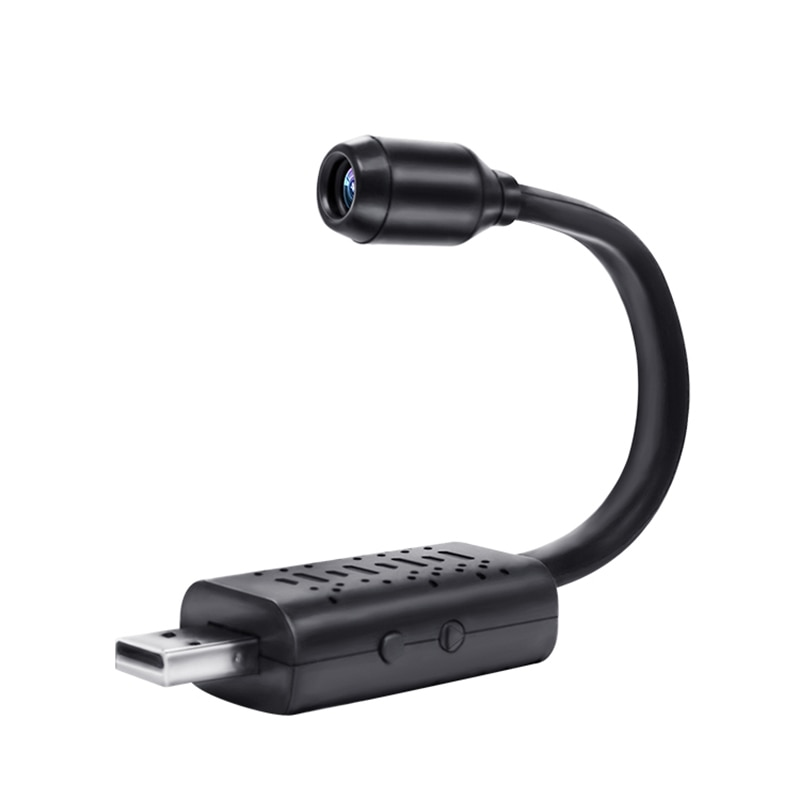

# Minicamera

HD 1080P Mini Wifi USB Motion Detection Wireless IP Camera [Product page](https://aliexpress.ru/item/1005002625522577.html)



## Components

* EFM845: must be either an Energy Micro CPU, either EFM PIC 32MZ (MIPS-32), or EFM32 Gecko (ARM Cortex)
* FT24C02A: 2048 bits EEPROM
* 25VQ32BTIG: 4Mb of flash memory by Zbit

## Current findings

```bash
strings Camera_Flash.bin | sort | less
```

Strings reveal a lot of LAME98/LAME99 entries, meaning that the firmware incorporates a lot of mp3 encoding logic.

```
binwalk -Y -k Camera_Flash.bin

DECIMAL       HEXADECIMAL     DESCRIPTION
--------------------------------------------------------------------------------
57399         0xE037          MIPS executable code, 32/64-bit, big endian, at least 502 valid instructions
1402132       0x156514        ARM executable code, 16-bit (Thumb), little endian, at least 543 valid instructions
2107738       0x20295A        ARM executable code, 16-bit (Thumb), big endian, at least 771 valid instructions
4180555       0x3FCA4B        MIPS executable code, 32/64-bit, little endian, at least 1250 valid instructions
```

Using [cpu_rec](https://github.com/airbus-seclab/cpu_rec) as a binwalk module:

```
git clone git@github.com:airbus-seclab/cpu_rec.git
cd cpu_rec 
cp cpu_rec.py $HOME/.config/binwalk/modules/
cp -rf cpu_rec_corpus $HOME/.config/binwalk/modules/
cd ..
binwalk -% Camera_Flash.bin

DECIMAL       HEXADECIMAL     DESCRIPTION
--------------------------------------------------------------------------------
0             0x0             None (size=0x1000, entropy=0.123998)
4096          0x1000          6502 (size=0x9800, entropy=0.999468)
43008         0xA800          None (size=0x4800, entropy=0.330900)
61440         0xF000          6502 (size=0x143800, entropy=0.999580)
1386496       0x152800        None (size=0x45000, entropy=0.872947)
1669120       0x197800        6502 (size=0x1000, entropy=0.984278)
1673216       0x198800        None (size=0x3000, entropy=0.729493)
1685504       0x19B800        6502 (size=0x1000, entropy=0.986415)
1689600       0x19C800        None (size=0x2800, entropy=0.652382)
1699840       0x19F000        6502 (size=0x1800, entropy=0.989103)
1705984       0x1A0800        None (size=0x2800, entropy=0.655410)
1716224       0x1A3000        6502 (size=0x1800, entropy=0.989339)
1722368       0x1A4800        None (size=0x4000, entropy=0.937326)
1738752       0x1A8800        X86-64 (size=0x1000, entropy=0.370963)
1742848       0x1A9800        None (size=0x3800, entropy=0.915077)
1757184       0x1AD000        X86-64 (size=0x1000, entropy=0.235745)
1761280       0x1AE000        None (size=0x2000, entropy=0.548850)
1769472       0x1B0000        6502 (size=0x2000, entropy=0.989682)
1777664       0x1B2000        None (size=0x3000, entropy=0.733288)
1789952       0x1B5000        6502 (size=0x2000, entropy=0.990214)
1798144       0x1B7000        None (size=0x1e000, entropy=0.868885)
1921024       0x1D5000        6502 (size=0x16000, entropy=0.944440)
2011136       0x1EB000        None (size=0x28800, entropy=0.890396)
2177024       0x213800        6502 (size=0x7000, entropy=0.992604)
2205696       0x21A800        None (size=0x3b000, entropy=0.896050)
2447360       0x255800        6502 (size=0x9000, entropy=0.993405)
2484224       0x25E800        None (size=0x5a000, entropy=0.286585)
2852864       0x2B8800        6502 (size=0x143000, entropy=0.999583)
4175872       0x3FB800        None (size=0x4800, entropy=0.266581)
```

```
rm ~/.config/binwalk/modules/cpu_rec_corpus/6502.corpus.xz
binwalk -% Camera_Flash.bin                                

DECIMAL       HEXADECIMAL     DESCRIPTION
--------------------------------------------------------------------------------
0             0x0             None (size=0x2000, entropy=0.664485)
8192          0x2000          PIC10 (size=0x8800, entropy=0.999371)
43008         0xA800          None (size=0x5800, entropy=0.489751)
65536         0x10000         PIC10 (size=0x134800, entropy=0.999593)
1329152       0x144800        None (size=0x6800, entropy=0.998095)
1355776       0x14B000        PIC10 (size=0x7800, entropy=0.995343)
1386496       0x152800        None (size=0x4d000, entropy=0.873396)
1701888       0x19F800        PIC10 (size=0x800, entropy=0.982092)
1703936       0x1A0000        None (size=0x119000, entropy=0.781130)
2854912       0x2B9000        PIC10 (size=0x134800, entropy=0.999593)
4118528       0x3ED800        None (size=0x6800, entropy=0.998045)
4145152       0x3F4000        PIC10 (size=0x7800, entropy=0.995475)
4175872       0x3FB800        None (size=0x4800, entropy=0.266581)
```

```
rm ~/.config/binwalk/modules/cpu_rec_corpus/PIC*
binwalk -% Camera_Flash.bin                        

DECIMAL       HEXADECIMAL     DESCRIPTION
--------------------------------------------------------------------------------
0             0x0             None (size=0x186800, entropy=0.990885)
1599488       0x186800        X86-64 (size=0x800, entropy=0.583911)
1601536       0x187000        None (size=0x21800, entropy=0.870839)
1738752       0x1A8800        X86-64 (size=0x1000, entropy=0.370963)
1742848       0x1A9800        None (size=0x3800, entropy=0.915077)
1757184       0x1AD000        X86-64 (size=0x1000, entropy=0.235745)
1761280       0x1AE000        None (size=0xd800, entropy=0.896253)
1816576       0x1BB800        X86-64 (size=0x1800, entropy=0.472472)
1822720       0x1BD000        None (size=0x37000, entropy=0.924111)
2048000       0x1F4000        X86-64 (size=0x1800, entropy=0.412424)
2054144       0x1F5800        None (size=0x8000, entropy=0.942108)
2086912       0x1FD800        X86-64 (size=0x1800, entropy=0.325338)
2093056       0x1FF000        None (size=0x8000, entropy=0.932566)
2125824       0x207000        X86-64 (size=0x1000, entropy=0.446596)
2129920       0x208000        None (size=0x1c000, entropy=0.936492)
2244608       0x224000        X86-64 (size=0x1000, entropy=0.451807)
2248704       0x225000        None (size=0xf800, entropy=0.904683)
2312192       0x234800        X86-64 (size=0x800, entropy=0.537907)
2314240       0x235000        None (size=0x1d000, entropy=0.901649)
2433024       0x252000        X86-64 (size=0x1000, entropy=0.531489)
2437120       0x253000        None (size=0x1ad000, entropy=0.904035)
```

Given that 6502 is too old, and X86-64 entropy is too low, the CPU is most likely PIC

## Machine code revealing

```bash
docker pull dockcross/linux-mips
docker run -v $(pwd):$(pwd) -it dockcross/linux-mips bash
```

```bash
apt update && apt install -y less
mips-unknown-linux-gnu-objdump -b binary -mmips:isa32 -D Camera_Flash.bin | less
```

```bash
/Applications/microchip/xc32/v3.01/bin/xc32-objdump -b binary -mmips -D Camera_Flash.bin | less
```

There is still a chance that the architecture is not PIC, or is PIC with some extensions, because some of the instructions could not be decoded by the disassembler:

```
    2000:       078fedfe        sd      t5,-28921(s7)
    2004:       34c92441        0x4124c934
    2008:       50a1c2a5        sh      v0,-24240(t6)
    200c:       1ed2890c        jal     0x2274878
    2010:       f1971211        beq     t0,s2,0xfffe7fd8
    2014:       a1c3fce0        sc      gp,-15455(a3)
    2018:       7704c3c4        lwc1    $f3,1143(a2)
    201c:       f4b1d160        daddi   s1,a2,-19980
    2020:       2e752bc0        ll      t3,29998(at)
    2024:       0df00c77        jalx    0xc33c035
    2028:       927c08a4        sh      t0,31890(zero)
    202c:       c34d7a83        lb      k0,19907(k1)
    2030:       5bfb6d18        0x186dfb5b
    2034:       c4b4a9e5        swc1    $f9,-19260(t5)
```

